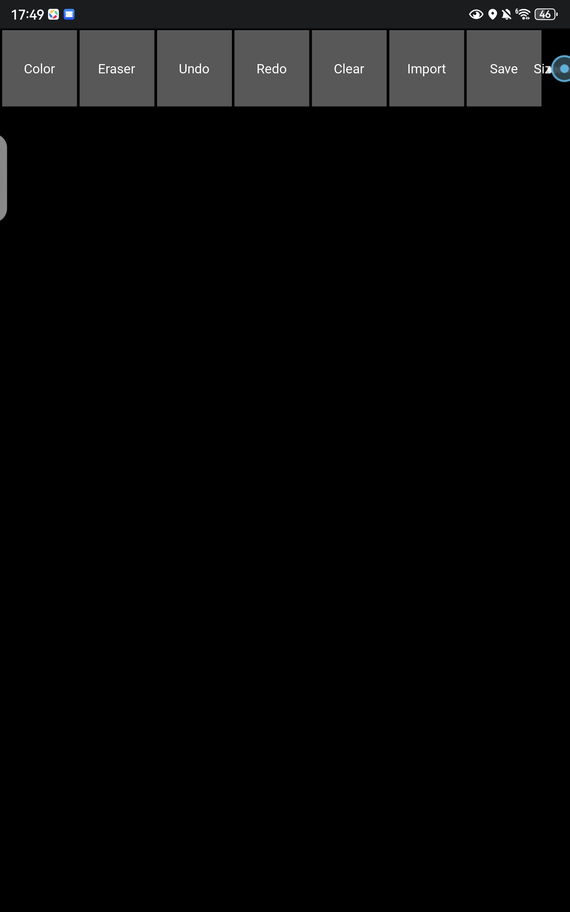
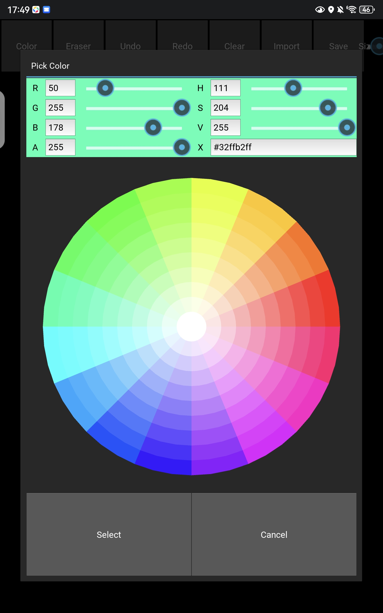
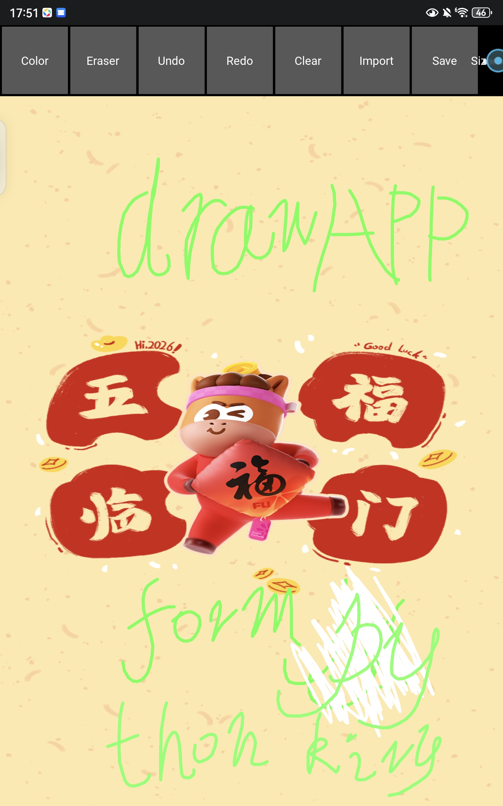
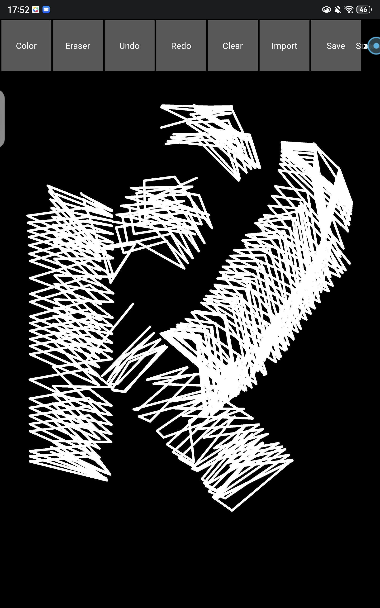

# 🎨 P-drawing-board

一个功能完整的绘图板应用，支持在图片上自由涂鸦、手绘标注，并提供丰富的画图工具与颜色管理。可导入本地图片作为画布背景，绘制完成后保存为 PNG 图片。

> 以上截图展示了工具界面、颜色拾取面板、绘图示例及完整工具栏

---

## ✨ 功能特性

- 🖌️ **自由绘图** – 支持鼠标/触摸绘制，可调节画笔大小
- 🎨 **颜色选择器** – RGB/HSV/Hex 全模式取色，支持透明度
- 🧽 **橡皮擦** – 快速擦除笔画，与画笔无缝切换
- 📸 **导入图片** – 将本地图片作为画板背景，在其上继续绘制
- ↩️ **撤销 / 重做** – 最多记录 50 步操作，便于纠错
- 🗑️ **清空画布** – 一键重置为纯白背景（保留导入图片效果则清空绘制）
- 💾 **保存作品** – 导出为 PNG 图片，自动包含背景图片与所有标注
- 🎛️ **直观工具栏** – 参考主流绘图应用布局，所有功能一目了然

---

## 🖱️ 界面预览

| 工具栏 | 颜色拾取面板 | 绘图示例 |
| --- | --- | --- |
|  |  |  |

工具包含：**Color / Eraser / Undo / Redo / Clear / Import / Save / Size 滑块**，且自带颜色预览圆点。

---

## 🚀 快速开始

### 快速体验
直接下载release里的APK即可运行（无需任何服务端环境）。

